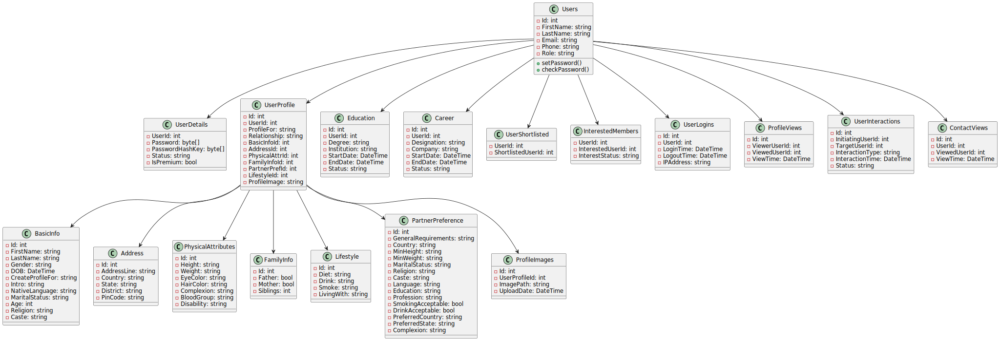

# Matrimonial App Document

## Table of Contents
- [Features](#features)
- [User Roles](#user-roles)
- [Database Schema](#database-schema)
- [Class Diagram](#class-diagram)
- [Technology Stack](#technology-stack)

## Features
1. **User Registration and Authentication**
   - Users can register with their basic details.
   - Email verification.
   - Password management with secure hashing.

2. **Profile Management**
   - Users can create and manage their profiles.
   - Include personal details, physical attributes, family info, lifestyle, and partner preferences.
   - Upload a profile image and manage a gallery of additional images.

3. **Search and Matching**
   - Search functionality to find potential matches.
   - Filters based on various criteria like age, religion, caste, etc.

4. **Premium Membership**
   - Premium members can see contact details.
   - Premium members can contact only 5 profiles per day

5. **Admin Dashboard**
   - Manage users, profiles, and monitor activities.

### Future Implementation If Possible

6. **Messaging**
   - In-app messaging system for communication between users.

7. **Notifications**
   - Real-time notifications for interests, messages, and profile views.

## User Roles
1. **Customer**
   - Regular users who can create profiles, search for matches, and interact with other users.
2. **Admin**
   - Administrators who manage the platform, monitor activities, and handle user issues.

## Database Schema
### Users
- **Id**: int (Primary Key)
- **FirstName**: string
- **LastName**: string
- **Email**: string
- **Phone**: string
- **Role**: string (Customer, Admin)

### UserDetails
- **UserId**: int (Foreign Key)
- **Password**: byte[]
- **PasswordHashKey**: byte[]
- **Status**: string (Active, Disabled)
- **IsPremium**: bool

### UserProfile
- **Id**: int (Primary Key)
- **UserId**: int (Foreign Key)
- **ProfileFor**: string
- **Relationship**: string
- **BasicInfoId**: int (Foreign Key)
- **AddressId**: int (Foreign Key)
- **PhysicalAttrId**: int (Foreign Key)
- **FamilyInfoId**: int (Foreign Key)
- **PartnerPrefId**: int (Foreign Key)
- **LifestyleId**: int (Foreign Key)
- **ProfileImage**: string

### BasicInfo
- **Id**: int (Primary Key)
- **FirstName**: string
- **LastName**: string
- **Gender**: string
- **DOB**: DateTime
- **CreateProfileFor**: string
- **Intro**: string
- **NativeLanguage**: string
- **MaritalStatus**: string
- **Age**: int
- **Religion**: string
- **Caste**: string

### Address
- **Id**: int (Primary Key)
- **AddressLine**: string
- **Country**: string
- **State**: string
- **District**: string
- **PinCode**: string

### PhysicalAttributes
- **Id**: int (Primary Key)
- **Height**: string
- **Weight**: string
- **EyeColor**: string
- **HairColor**: string
- **Complexion**: string
- **BloodGroup**: string
- **Disability**: string

### FamilyInfo
- **Id**: int (Primary Key)
- **Father**: bool
- **Mother**: bool
- **Siblings**: int

### Lifestyle
- **Id**: int (Primary Key)
- **Diet**: string
- **Drink**: string
- **Smoke**: string
- **LivingWith**: string

### PartnerPreference
- **Id**: int (Primary Key)
- **GeneralRequirements**: string
- **Country**: string
- **MinHeight**: string
- **MinWeight**: string
- **MaritalStatus**: string
- **Religion**: string
- **Caste**: string
- **Language**: string
- **Education**: string
- **Profession**: string
- **SmokingAcceptable**: bool
- **DrinkAcceptable**: bool
- **PreferredCountry**: string
- **PreferredState**: string
- **Complexion**: string

### Education
- **Id**: int (Primary Key)
- **UserId**: int (Foreign Key)
- **Degree**: string
- **Institution**: string
- **StartDate**: DateTime
- **EndDate**: DateTime
- **Status**: string

### Career
- **Id**: int (Primary Key)
- **UserId**: int (Foreign Key)
- **Designation**: string
- **Company**: string
- **StartDate**: DateTime
- **EndDate**: DateTime
- **Status**: string

### UserShortlisted
- **UserId**: int (Primary Key)
- **ShortlistedUserId**: int

### InterestedMembers
- **UserId**: int (Primary Key)
- **InterestedUserId**: int
- **InterestStatus**: string

### UserLogins
- **Id**: int (Primary Key)
- **UserId**: int (Foreign Key)
- **LoginTime**: DateTime
- **LogoutTime**: DateTime
- **IPAddress**: string

### ProfileViews
- **Id**: int (Primary Key)
- **ViewerUserId**: int
- **ViewedUserId**: int
- **ViewTime**: DateTime

### UserInteractions
- **Id**: int (Primary Key)
- **InitiatingUserId**: int
- **TargetUserId**: int
- **InteractionType**: string
- **InteractionTime**: DateTime
- **Status**: string

### ProfileImages
- **Id**: int (Primary Key)
- **UserProfileId**: int (Foreign Key)
- **ImagePath**: string
- **UploadDate**: DateTime

### ContactViews
- **Id**: int (Primary Key)
- **UserId**: int
- **ViewedUserId**: int
- **ViewTime**: DateTime

### Future Implementation If Possible

### Messages
- **Id**: int (Primary Key)
- **SenderId**: int
- **ReceiverId**: int
- **MessageText**: string
- **SentTime**: DateTime
- **ReadTime**: DateTime

### Payments
- **Id**: int (Primary Key)
- **UserId**: int
- **Amount**: decimal
- **PaymentDate**: DateTime
- **PaymentMethod**: string
- **Status**: string

### Notifications
- **Id**: int (Primary Key)
- **UserId**: int
- **NotificationType**: string
- **Message**: string
- **IsRead**: bool
- **CreatedAt**: DateTime

### AdminLogs
- **Id**: int (Primary Key)
- **AdminId**: int
- **Action**: string
- **Details**: string
- **Timestamp**: DateTime

## Class Diagram

## Technology Stack
- **Frontend**: React.js
- **Backend**: ASP .NET
- **Database**: MS SQL
- **Cloud Service**: Azure
